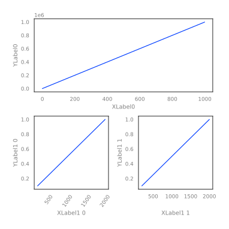

Simple hugo theme to be dead easy on the reader.

## Installation

- Initialize go module

  ```bash
  hugo mod init <module_path>
  ```

- Add theme to your `config.yml`

  ```yml
  module:
    imports:
      - path: github.com/barklan/hugo-dead-simple
  ```

- Fetch theme

  ```bash
  hugo mod get -u
  ```

## Configuration

### Site parameters

This site's config can be found [here](https://github.com/barklan/hugo-dead-simple-example/blob/main/config.yaml).

### Section parameters

```yaml {linenos=inline}
---
title: "Section title"
weight: 1
nodate: false # display date next to post title
---
```

### Page parameters

```yaml {linenos=inline}
---
title: "Post/Page title"
subtitle: "...example subtitle"
date: "2023-08-11"
toc: true # table of contents (only h2 and h3 added to toc)
bold: true # display post title in bold in posts list
math: true # load katex
categories:
  - ...
tags:
  - ...
next: true # show link to next post in footer
nomenu: true # hide site menu
notitle: true # hide title
---
```

## Deployment

- [Generate](https://favicon.io/favicon-generator/) and add favicons to `/static`
- Deploy your site to Netlify with this `netlify.toml`

  ```toml {linenos=inline}
  [build]
  publish = "public"
  command = "hugo --gc --minify"

  [context.production]
  environment = { HUGO_VERSION = "0.114.1" }
  ```

## Post features


**Hugo shortcodes**

In all examples you’ll need to adjust code so the `%` or `<` are touching the `{` like this: `{%`.


### Footnotes

```txt
Here's a sentence with a footnote.[^1]

[^1]: This is unnamed footnote.
```

Here's a sentence with a footnote.[^1]

[^1]: This is unnamed footnote.

### Mark

```html
<mark>Marked text</mark>
```

<mark>Marked text</mark>

### Boxes

```
{{ < box info >}}
**This is a bold line**

Hello there, and have a nice day
{{ < /box >}}
```

`info`, `tip`, `warning`, `important`


**This is a bold line**

Hello there, and have a nice day



Hello there, and have a nice day



Hello there, and have a nice day



Hello there, and have a nice day


### Collapsible

```html
<details>
  <summary>Collapsible</summary>

  
</details>
```

<details>
<summary>Collapsible</summary>


```txt
some code
```

</details>

### Tables

Use [table generator](https://www.tablesgenerator.com/markdown_tables).

### Code

Code blocks support usual Hugo highlighting features. Additionally "copy" button is added to each code block automatically.

````txt
```go {linenos=inline,hl_lines=[2, "6-9"],linenostart=19}
// ... code
```
````

Produces:

```go {linenos=inline,hl_lines=[2, "6-9"],linenostart=19}
func randPass(n uint8, extraChars string) (string, error) {
	const base = "0123456789abcdefghijklmnopqrstuvwxyz-"
	letters := base + extraChars
	ret := make([]byte, n)
	var i uint8
	for i = 0; i < n; i++ {
		num, err := rand.Int(rand.Reader, big.NewInt(int64(len(letters))))
		if err != nil {
			return "", err
		}
		ret[i] = letters[num.Int64()]
	}

	return string(ret), nil
}
```

#### Smaller code

````txt
```go {.fs90}
num, err := rand.Int(rand.Reader, big.NewInt(int64(len(letters))))
```
````

Produces:

```go {.fs90}
num, err := rand.Int(rand.Reader, big.NewInt(int64(len(letters))))
```

Available classes: `fs95`, `fs90`, `fs85`, `fs80`, `fs75`, `fs70` and `fs50`.

### Katex

#### Inline

```txt
\\(\pi = 3.14\\)
```

\\(\pi = 3.14\\)

#### Block

```txt
$$
\begin{align}
\sqrt{37} & = \sqrt{\frac{73^2-1}{12^2}} \\\
 & = \sqrt{\frac{73^2}{12^2}\cdot\frac{73^2-1}{73^2}} \\\
 & = \frac{73}{12}\sqrt{1 - \frac{1}{73^2}} \\\
 & \approx \frac{73}{12}\left(1 - \frac{1}{2\cdot73^2}\right)
\end{align}
$$
```

$$
\begin{align}
\sqrt{37} & = \sqrt{\frac{73^2-1}{12^2}} \\\
 & = \sqrt{\frac{73^2}{12^2}\cdot\frac{73^2-1}{73^2}} \\\
 & = \frac{73}{12}\sqrt{1 - \frac{1}{73^2}} \\\
 & \approx \frac{73}{12}\left(1 - \frac{1}{2\cdot73^2}\right)
\end{align}
$$

Note that using Hugo you need `\\\` to break the line instead of usual `\\`.
If you don't want automatic numbering you can use `\begin{align*}`.

Use [supported functions](https://katex.org/docs/supported.html) and [support table](https://katex.org/docs/support_table.html) for reference.

### File trees

Use [tree.nathanfriend.io](https://tree.nathanfriend.io/) to make beautiful file tree
structures like this one:

```txt {.denser}
.
├── tmp/
│   ├── __init__.py
│   └── temp.py
├── src/
│   ├── __init__.py
│   └── main.py
└── Dockerfile
```

### Images

#### General

All images are lazy-loaded.
You can use the usual `` to insert images.


Internally it uses `imgp` class. You can customize images like this:

```html
<p class="imgp">
  
</p>
```

<p class="imgp">

</p>

#### Figure element

```txt
{{ < figure src="./pinkrose.avif" title=">An elephant at sunset" >}}
```

As with images, you can customize figure:

```html
<figure>
  
  <figcaption>Pink rose</figcaption>
</figure>
```

<figure>
  
  <figcaption>Pink rose</figcaption>
</figure>

#### Plots

To make the charts look good use this context manager:

```python
import matplotlib.pyplot as plt
import matplotlib as mpl
import numpy as np
import seaborn as sns


class Blog:

    def __init__(self, filename, figsize=(6, 6), axis=True):
        self.filename = filename
        self.figsize = figsize
        self.axis = axis

    def set_plot(self, figsize=(6, 6)):
        sns.set()
        sns.set_theme(style="white", palette="bright")
        COLOR = "grey"
        mpl.rcParams["text.color"] = COLOR
        mpl.rcParams["axes.labelcolor"] = COLOR
        mpl.rcParams["xtick.color"] = COLOR
        mpl.rcParams["ytick.color"] = COLOR
        plt.figure(figsize=self.figsize)
        sns.set_context("paper")

    def save_plot(self):
        if self.axis:
            plt.axis("on")
        else:
            plt.axis("off")
        plt.savefig(self.filename, format="svg",
                    bbox_inches="tight", pad_inches=0.3,
                    transparent=True)

    def __enter__(self):
        self.set_plot()
        return self

    def __exit__(self, exc_type, exc_value, exc_traceback):
        self.save_plot()
```

Then you can use it like this

```python
x = np.arange(0, 10, 0.00001)
y = x * np.sin(2 * np.pi * x)
fmri = sns.load_dataset("fmri")

with Blog("fmri.svg", figsize=(7, 7), axis=True):
    sns.lineplot(x="timepoint", y="signal",
                 hue="region", style="event",
                 data=fmri)
```


Looks good in light and dark mode!



### Image galleries

You can create image galleries with this:

```html
<ul class="image-gallery">
    <li><figure>
          
          <figcaption>Pink rose</figcaption>
    </figure></li>
    <li><figure>
          
          <figcaption>Pink rose</figcaption>
    </figure></li>
</ul>
```

<ul class="image-gallery">
    <li><figure>
          
          <figcaption>Pink rose</figcaption>
    </figure></li>
    <li><figure>
          
          <figcaption>Not a rose</figcaption>
    </figure></li>
</ul>

If you want three images in a row additionally add `three-image-gallery` class to `ul`.

#### Two images

```txt
{{ < twoimg "./pinkrose.avif" "./flower.avif" >}}
```



#### Three images

```txt
{{ < threeimg "./pinkrose.avif" "./flower.avif" "./pinkrose.avif" >}}
```



### YouTube

```txt
{{ < youtube w7Ft2ymGmfc >}}
```

### Attachments

```txt
{{ < attachments folder="temp" title="Boom" caption="example" >}}
```

`title` and `caption` can be omitted.



### Columns

```txt
{{ % columns %}}

#### Title 1

Lorem Ipsum is simply dummy text of the printing and typesetting industry.
Lorem Ipsum has been the industry's standard dummy text ever since the 1500s.

<--->

#### Title 2

Lorem Ipsum is simply dummy text of the printing and typesetting industry.
Lorem Ipsum has been the industry's standard dummy text ever since the 1500s

{{ % /columns %}}
```

{}

#### Title 1

Lorem Ipsum is simply dummy text of the printing and typesetting industry.
Lorem Ipsum has been the industry's standard dummy text ever since the 1500s.

<--->

#### Title 2

Lorem Ipsum is simply dummy text of the printing and typesetting industry.
Lorem Ipsum has been the industry's standard dummy text ever since the 1500s

{}

### Tabs

```txt
{{ < tabs >}}
{{ < tab "MacOS" >}}

This is tab **MacOS** content.

Lorem markdownum insigne. Olympo signis Delphis! Retexi Nereius nova develat
stringit, frustra Saturnius uteroque inter!
{{ < /tab >}}

{{ < tab "Linux" >}}

This is tab **Linux** content.

{{ < /tab >}}

{{ < tab "Windows" >}}

This is tab **Windows** content.

Lorem markdownum insigne. Olympo signis Delphis! Retexi Nereius nova develat
stringit, frustra Saturnius uteroque inter!
{{ < /tab >}}
{{ < /tabs >}}
```




This is tab **MacOS** content.

Lorem markdownum insigne. Olympo signis Delphis! Retexi Nereius nova develat
stringit, frustra Saturnius uteroque inter!




This is tab **Linux** content.





This is tab **Windows** content.

Lorem markdownum insigne. Olympo signis Delphis! Retexi Nereius nova develat
stringit, frustra Saturnius uteroque inter!



## Dev update notes

- Update Iosevka font
- Update Inter font
- Update jquery in footer
- Update Katex
